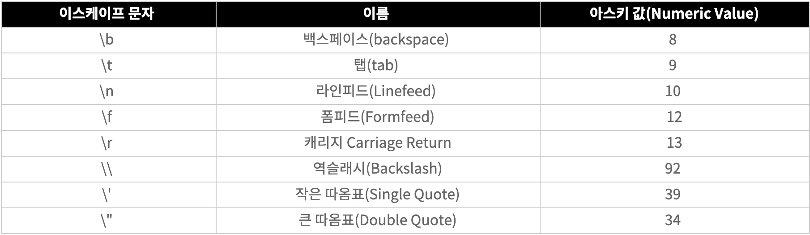

**Big-O 표기법** : 입력값이 무한대로 향할때 함수의 **상한**을 설명하는 수학적 표기 방법.



상수 : 1

1. O(1) : 데이터가 증가함에 따른 성능 변화가 없다.

   ```python
   n = list(input())
   if n[0] == 0:
   	print(true)
   ```

   - 기울기가 0인 그래프
   - 최고의 알고리즘
   - ex) 테이블의 조회 및 삽입

2. O(n) : 입력 데이터 크기와 비례하여 처리 시간이 증가한다.

   ```python
   n = int(input())
   for i in range(n):
   	print(i)
   ```

   - 그래프가 선형 그래프
   - 선형시간 알고리즘이라고 한다.
   - **순차탐색**

3. O(n^2)

   ```python
   n = int(input())
   for i in range(n):
   	for j in range(n):
   		print(i+j)
   ```

   

   - n이 하나 늘어날 때마다 가로, 세로 한 줄씩 늘어남.
   - 그래프가 x≥0 인 2차함수의 형태
   - ex) bubble sort 같은 비효율적인 정렬 알고리즘

4. O(n^3)

   ```python
   n = int(input())
   for i in range(n):
   	for j in range(n):
   		for k in range(n):
   			print(i+j+k)
   ```

   

   - n이 하나 늘어날 때마다 가로, 세로, 높이 한 칸씩 늘어남.
   - O(n^2)와 같은 형태이지만 n이 증가함에 따라 더 급격히 증가.

5. O(2^n)

   - ex) Fobonacci Numbers를 재귀로 계산하는 알고리즘
   - 한 숫자를 호출하기 위해서 그 전단계의 2개의 수를 호출해야 한다. 이를 n번 반복

   

6. O(log n)
   - binary search(**이진탐색**) 이 대표적이다.
     - key 값을 찾기 위해 배열의 중간값과 key값을 비교한다.
     - 한번 처리가 진행될 때마다 검색해야할 데이터 양이 1/2이 된다.
   - 매우 큰 입력값에도 크게 영향을 받지 않는다.
     

O(2n) ⇒ O(n)

- 실제 알고리즘의 러닝타임이 아니라, 장기적으로 데이터가 증가함에 따른 처리시간의 증가율을 예측한다.
- 상수는 고정된 숫자이기 때문에 증가하지 않는 숫자는 신경쓰지 않기 위해 상수 생략
- 이와 같이 O(n^2 + n^2) ⇒ O(n^2) 으로 표기한다.
